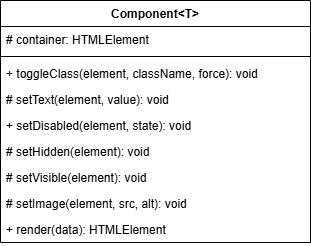

# Проектная работа "Веб-ларек" - интернет-магазин с товарами для веб-разработчиков

## Описание проекта
"Веб-ларек" - интернет-магазин с товарами для веб-разработчиков. В нём можно посмотреть
каталог товаров, добавить товары в корзину и сделать заказ, при оформлении
пользователю необходимо ввести способ оплаты, email, номер телефона, адрес

Проект реализован на TypeScript и представляет собой SPA (Single Page Application) с использованием API для получения данных о товарах и создание заказа. Также на странице
есть модальные окна карточки товара, корзины и оформления заказа.

## Установка и запуск
Для установки и запуска проекта необходимо выполнить команды
```shell
npm install
npm run start
```
или
```shell
yarn
yarn start
```
## Сборка
```shell
npm run build
```
или
```shell
yarn build
```
Стек: HTML, SCSS, TS, Webpack

Структура проекта:
- src/ — исходные файлы проекта
- src/components/ — папка с JS компонентами
- src/components/base/ — папка с базовым кодом

Важные файлы:
- src/pages/index.html — HTML-файл главной страницы
- src/types/index.ts — файл с типами
- src/index.ts — точка входа приложения
- src/scss/styles.scss — корневой файл стилей
- src/utils/constants.ts — файл с константами
- src/utils/utils.ts — файл с утилитами

## Архитектура проекта (MVP)


Класс `Component<T>` - это базовый, абстрактный класс отображения, от которого наследуются "общие" классы
отображения `Modal`, `Basket`, `Form`, `Success`.

Также, в текущем проекте используются классы `Page`, `Card`, `Order`, `Contacts`

# Model

# View

# Presenter

# Список событий

- products:changed - изменились элементы каталога
- product:select - открыть карточку продукта
- order:open - начать оформление заказа
- order:changed - изменилось одно из полей формы заказа
- order:submit - отправить форму заказа
- basket:add - добавление товара в корзину
- basket:remove - удаление товара из корзины
- basket:clear - очистить корзину после оформления заказа
- basket:open - открытие корзины
- basket:close - закрытие корзины
- modal:open - блокирует прокрутку страницы если открыто модальное окно
- modal:close - разблокирует прокрутку страницы, когда модальное окно закрывается
- formErrors:changed - имзенилось состояние валидации формы
