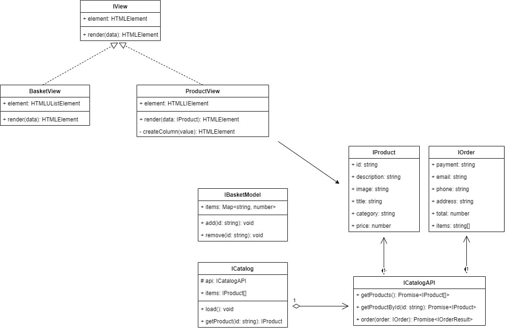

# Проектная работа "Веб-ларек" - интернет-магазин с товарами для веб-разработчиков

## Описание проекта
"Веб-ларек" - интернет-магазин с товарами для веб-разработчиков. В нём можно посмотреть
каталог товаров, добавить товары в корзину и сделать заказ, при оформлении
пользователю необходимо ввести способ оплаты, email, номер телефона, адрес

Проект реализован на TypeScript и представляет собой SPA (Single Page Application) с использованием API для получения данных о товарах и создание заказа. Также на странице
есть модальные окна карточки товара, корзины и оформления заказа.

## Выбранная архитектура - Событийно-ориентированная
У нас есть модели, вьюшки и брокер событий и весь код будет 
собираться вместе в index.ts

## Установка и запуск
Для установки и запуска проекта необходимо выполнить команды
```shell
npm install
npm run start
```
или
```shell
yarn
yarn start
```
## Сборка
```shell
npm run build
```
или
```shell
yarn build
```
Стек: HTML, SCSS, TS, Webpack

Структура проекта:
- src/ — исходные файлы проекта
- src/components/ — папка с JS компонентами
- src/components/base/ — папка с базовым кодом

Важные файлы:
- src/pages/index.html — HTML-файл главной страницы
- src/types/index.ts — файл с типами
- src/index.ts — точка входа приложения
- src/scss/styles.scss — корневой файл стилей
- src/utils/constants.ts — файл с константами
- src/utils/utils.ts — файл с утилитами

## Архитектура проекта (MVC)
На данной архитектуре есть интерфейсы моделей данных и моделей отображения. Реализаций здесь нет,
это сделано, чтобы не усложнять данный рисунок.


# Модели (Model) 

Здесь у нас интерфейсы с которыми мы будем работать, 
реализация интерфейса ICatalog - будет хранить api, items, и имеет метод load.
реализация интерфейса ICatalogAPI - будет делать запросы к серверу.
реализации интерфейсов IProduct и IOrder будут хранить информацию об объекте продукта и заказа.
```ts
interface ICatalog {
    api: ICatalogAPI,
    items: IProduct[],
    load(): void
}

interface ICatalogAPI {
    getProducts(): Promise<IProduct[]>;
    getProductById(id: string): Promise<IProduct>;
    order(order: IOrder): Promise<IOrderResult>
} 

interface IProduct {
    id: string,
    description: string,
    image: string,
    title: string,
    category: string,
    price: number
}

interface IOrder {
    payment: string,
    email: string,
    phone: string,
    address: string,
    total: number,
    items: string[]
}
```

# Отображение (View)
```ts
interface IView {
  element: HTMLElement;
  render(data?: object): HTMLElement;
}

class BasketView implements IView {
    constructor(protected container: HTMLElement) {}
    render(data: { items: HTMLElement[] }) {
        
    }
}

class ProductView implements IView {
  element: HTMLLIElement;
  render(data: { items: HTMLElement }) {

  }
}
```

# Events (IEventEmitter)

Так как мы выбрали архитектуру событийно-ориентированную, 
то у нас есть брокер событий.

Брокер событий
```ts
interface IEventEmitter {
  emit: (event: string, data: unknown) => void;
}
```
Например в данном случае мы слушаем события 'basket:change', 'ui:basket-add',
'ui:basket-remove' и в зависимости от события делаем разные действия, рендерим корзину,
добавляем новый элемент в корзину, удаляем элемент из корзины
```ts
events.on('basket:change', (event: { items: string[] }) => {
  renderBasket(event.items);
});

events.on('ui:basket-add', (event: { id: string }) => {
  basketModel.add(event.id);
});

events.on('ui:basket-remove', (event: { id: string }) => {
  basketModel.remove(event.id);
});
```